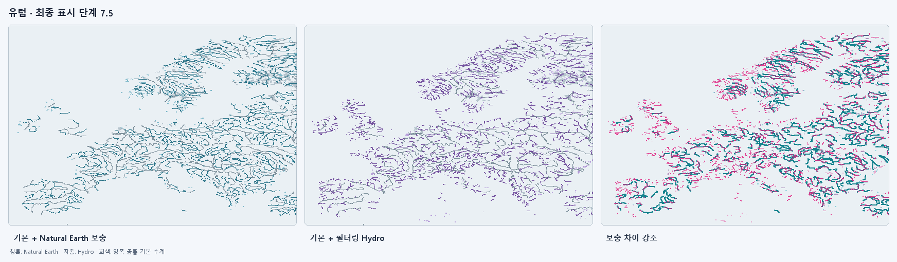
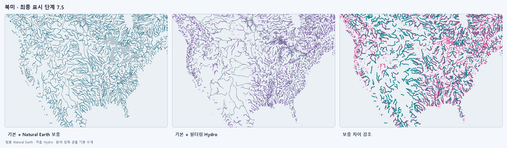
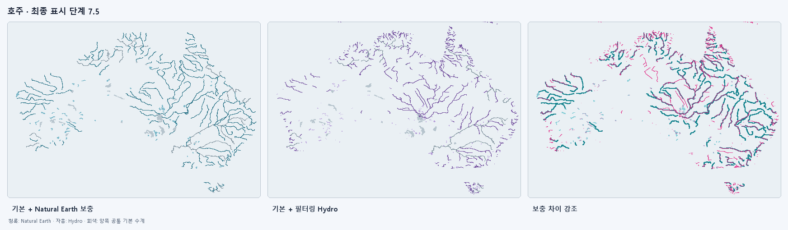
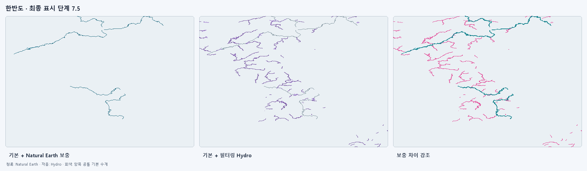

# 판도연구소 수계 자료 캘리브레이션 보고서

이 보고서는 Natural Earth 전 세계 기본 수계를 유지한 상태에서 HydroRIVERS/HydroLAKES 보충 후보를 유럽·북미·호주의 Natural Earth 1:10m 보충 레이어와 같은 화면 밀도로 맞춘 1차 분석 결과입니다. 아래의 원래 비교 결과와 이미지는 보존했으며, 이후 성능 우선 절대 밀도 기준을 채택한 v0.12.1 적용 결과는 `후속 적용` 절에 별도로 기록합니다.

## 후속 적용 — v0.12.1 성능 우선 기준

지역별 밀도를 억지로 맞추는 대신 전 세계에 같은 중요도·면적 기준을 적용했습니다.

- 강 중요도: `ORD_STRA + 4×log10(DIS_AV_CMS) - 0.5×log10(UPLAND_SKM)`
- 강 단계 임계값: `14.4744 → 12.4307 → 11.2137 → 10.7957`
- 호수 최소 면적: `50㎢`, 표시 단계 `250㎢ → 100㎢ → 50㎢`
- 총 객체: 17,672개
- 원본 좌표: 4,532,876개
- 압축 자산: 17,458,770 bytes (약 16.65MiB)
- pack 789개, 공간 인덱스 타일 809개, 최대 pack 약 1.64MiB
- Natural Earth 기본 수계 잔여 중복: 강 0.68%, 호수 0.19%
- 한반도 범위: Natural Earth 강 8개 + Hydro 강 18개, Natural Earth 호수 1개 + Hydro 호수 5개

선택된 원본 좌표는 줄이지 않았습니다. 같은 ID의 Natural Earth 강 조각과 같은 표시 단계의 Hydro reach만 MultiLineString/연결 수계 단위로 묶었습니다. 실행 자산의 상세 수치는 [`performance-v0.12.1.json`](./performance-v0.12.1.json)에 기록합니다.

## 결론

**보류 · 현재 제약으로는 전 세계 교체에 사용할 수 없습니다.**

- 통과: `riverFinalWithin15Percent`
- 미통과: `intermediateScreenWithin25Percent`
- 미통과: `lakeFinalWithin20Percent`
- 통과: `baseOverlapBelow2Percent`
- 통과: `representativeFeaturesPresent`

세 기준 지역에 지역별 예외값을 두지 않고 같은 공식과 같은 단계 임계값을 사용했습니다. 비교 비율은 실제 표시 조합인 `(Natural Earth 기본 + Hydro 보충) / (Natural Earth 기본 + Natural Earth 보충)`이며 1.0에 가까울수록 같은 밀도입니다. 미통과 항목이 하나라도 있으면 런타임 자료를 교체하지 않습니다.

## 최적 탐색값 (합격 기준 미달)

- 강: `ORD_STRA + 4.00 × log10(DIS_AV_CMS) -0.50 × log10(UPLAND_SKM)`
- 강 임계값: 6.0 → 10.7957, 6.7 → 8.7520, 7.0 → 7.5350, 7.5 → 7.1171
- 호수: `1.00 × log10(Lake_area) + 0.00 × log10(Shore_len)`
- 호수 임계값: 6.0 → 2.0283, 6.7 → 1.6211, 7.0 → 1.3320, 7.5 → 1.3320
- 강 중복 판정: 기본 강 4 km 회랑과 중첩 길이, 주방향 유사도를 함께 사용했습니다.
- 호수 중복 판정: 기본 호수와의 IoU, 객체 면적 중첩률, 중심점 및 경계 거리를 함께 사용했습니다.

## 지역별 결과

### 유럽



| min_zoom | 표시 강 수 | 강 길이 비 | 강 화면 비 | 표시 호수 수 | 호수 수 비 | 호수 화면 비 |
|---:|---:|---:|---:|---:|---:|---:|
| 6.0 | 3,400 | 0.646 | 0.640 | 136 | 0.739 | 0.971 |
| 6.7 | 9,414 | 0.749 | 0.737 | 276 | 0.914 | 1.015 |
| 7.0 | 16,247 | 0.933 | 0.916 | 588 | 0.958 | 1.031 |
| 7.5 | 19,170 | 1.039 | 1.019 | 588 | 0.958 | 1.031 |

기본 수계 잔여 중복: 강 0.8%, 호수 0.0%.
### 북미



| min_zoom | 표시 강 수 | 강 길이 비 | 강 화면 비 | 표시 호수 수 | 호수 수 비 | 호수 화면 비 |
|---:|---:|---:|---:|---:|---:|---:|
| 6.0 | 9,462 | 0.829 | 0.829 | 374 | 1.331 | 1.048 |
| 6.7 | 20,950 | 0.796 | 0.795 | 816 | 1.786 | 1.073 |
| 7.0 | 34,598 | 0.908 | 0.907 | 1,626 | 1.897 | 1.072 |
| 7.5 | 39,827 | 0.998 | 0.997 | 1,626 | 1.897 | 1.072 |

기본 수계 잔여 중복: 강 0.6%, 호수 0.0%.
### 호주



| min_zoom | 표시 강 수 | 강 길이 비 | 강 화면 비 | 표시 호수 수 | 호수 수 비 | 호수 화면 비 |
|---:|---:|---:|---:|---:|---:|---:|
| 6.0 | 1,612 | 1.647 | 1.612 | 68 | 1.478 | 1.025 |
| 6.7 | 4,736 | 1.392 | 1.386 | 147 | 1.909 | 0.952 |
| 7.0 | 7,549 | 1.100 | 1.096 | 242 | 2.469 | 0.928 |
| 7.5 | 8,657 | 0.969 | 0.968 | 242 | 2.104 | 0.888 |

기본 수계 잔여 중복: 강 0.2%, 호수 0.0%.
### 한반도



| min_zoom | 표시 강 수 | 강 길이 비 | 강 화면 비 | 표시 호수 수 | 호수 수 비 | 호수 화면 비 |
|---:|---:|---:|---:|---:|---:|---:|
| 6.0 | 264 | 3.910 | 3.792 | 0 | — | — |
| 6.7 | 761 | 9.610 | 9.254 | 7 | — | — |
| 7.0 | 1,149 | 3.654 | 3.576 | 19 | 19.000 | 5.697 |
| 7.5 | 1,338 | 3.436 | 3.365 | 19 | 19.000 | 5.697 |

기본 수계 잔여 중복: 강 0.5%, 호수 0.0%.


## 연결 체인과 전 세계 예상치

아래 수치는 현재 최적 탐색값을 적용한 참고치이며, 미통과 상태이므로 배포 용량 계획에 사용하면 안 됩니다.

- 기준 지역 최종 선택 reach: 66,453개
- 연결 후 체인: 9,520개 (85.7% 감소)
- 좌표: 379,489개 → 379,489개 (삭제·단순화 없음)
- 전 세계 예상 reach: 1,897,879개
- 전 세계 예상 체인: 271,889개
- 전 세계 예상 강 좌표: 10,838,099개
- 전 세계 예상 호수 객체: 57,094개
- 예상 gzip 압축 용량: 약 573.1 MiB
- 최종 단계 렌더 부하는 현재 Natural Earth 지역 보충 수계 대비 강 1.46배, 호수 0.99배로 추정합니다.

## 대표 수계 확인

- 나일강: 확인
- 다뉴브강: 확인
- 미시시피강: 확인
- 머리강: 확인
- 오대호: 확인

## 재현 방법

Python 3.11 이상과 `pyshp>=3.0`, `shapely>=2.0`이 필요합니다. HydroRIVERS 대륙별 Shapefile과 전 세계 HydroLAKES Shapefile을 준비한 뒤 저장소 루트에서 실행합니다.

```powershell
python tools/calibrate-hydro.py `
  --hydrorivers-root <HydroRIVERS-대륙별-파일-폴더> `
  --hydrolakes <HydroLAKES_polys_v10.shp> `
  --natural-earth-root assets/data/hydro `
  --output reports/hydro-calibration
```

`results.json`에는 공식, 단계별 원시 지표, 중복률, 입력 파일 정보가 들어 있습니다. 비교 PNG는 동일 범위·등거리 경위도 화면·동일 선폭으로 생성했습니다. 회색은 양쪽에 공통인 Natural Earth 기본 수계입니다. 한반도는 Natural Earth 지역 보충 자료가 없으므로 현재 전 세계 기본 수계를 왼쪽 기준으로 표시하며 최적화 목적함수에는 넣지 않았습니다.

## 1차 분석 당시 적용 경계

이 절의 보류 결론은 위 1차 분석에 대한 기록입니다. 후속 v0.12.1에서는 전 세계 공통 절대 밀도 기준을 선택해 기존 지역 보충 자료를 타일형 Hydro 보충 자료로 교체했습니다.
