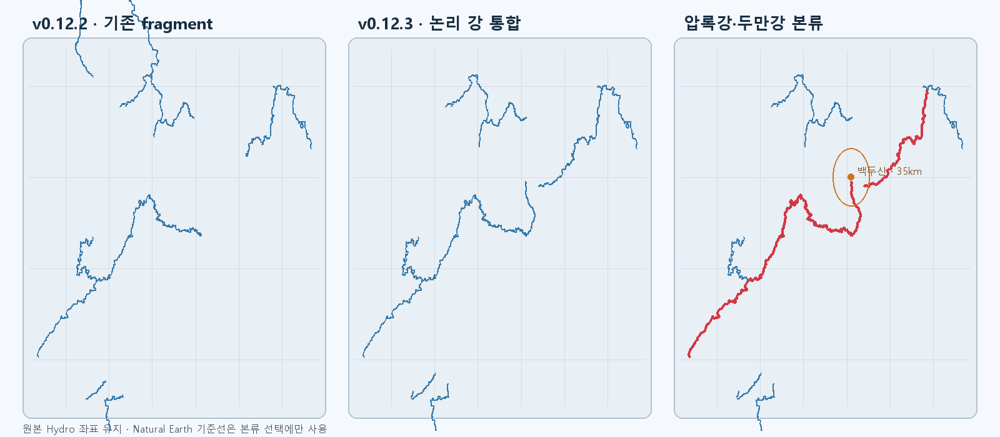

# AtlasWright v0.12.3 수계 검증

- 압록강은 하나의 논리 강 객체이며 백두산 기준점에서 가장 가까운 원본 Hydro 꼭짓점까지 약 4.82km입니다.
- 두만강은 하나의 논리 강 객체이며 같은 기준점에서 약 26.96km입니다.
- 최고 세부 단계의 임계값은 10.55이며, 선택한 수계는 `NEXT_DOWN`을 따라 하구·내륙 종점까지 폐합했습니다.
- 1,274개 누락 하류 reach를 연결성 보정으로 추가했습니다.
- 비내륙성 하구 중 해안선과 2km 이내로 어긋난 1,069개 끝점은 렌더링할 때만 해안선에 맞췄습니다.
- 910개 pack을 11개 정적 shard로 묶었고 전체 압축 용량은 약 39.68MiB입니다.
- 좌표는 단순화하지 않고 Hydro 원본을 1e-6도 Int32로 보존했습니다.

정량 결과는 `validation.json`에 기록되어 있습니다.
