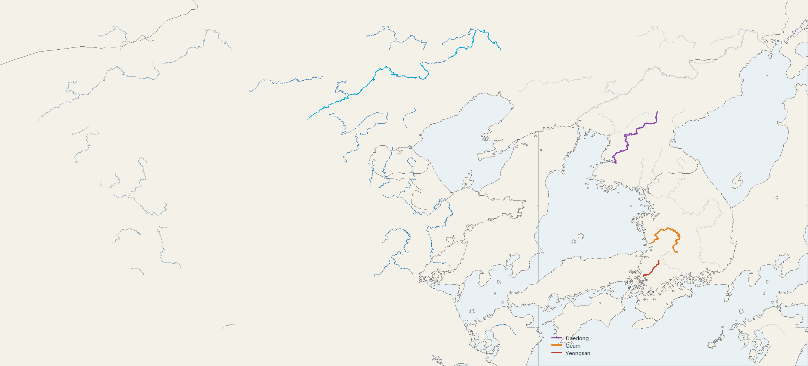

# AtlasWright v0.12.4 수계 검증

- 전 세계 공통 기준으로 최종 유역면적 2,500㎢ 이상인 3,662개 유역의 대표 본류를 보존했습니다.
- 대동강·금강·영산강은 각각 하나의 논리 강 객체로 발원부부터 하구까지 연결됩니다.
- 압록강은 백두산 기준점에서 4.82km, 두만강은 9.44km 이내까지 이어집니다.
- 내장 공유국경에 맞춘 구간은 373개 논리 강, 12,988개 source reach, 약 47,997.9km입니다.
- 한반도 주변 정렬 길이는 `CHN/PRK` 998.4km, `PRK/RUS` 31.5km이며, 정렬 좌표는 해당 Natural Earth 공유국경 경로와 일치합니다.
- 12개 정적 shard의 전체 압축 용량은 45,316,169바이트(약 43.22MiB)로 48MiB 제한을 통과했습니다.
- 원본 Hydro 꼭짓점은 단순화하지 않았으며 국경 정렬은 표시·선택 형상에만 적용했습니다. 국가 폴리곤은 변경하지 않았습니다.

정량 결과는 `validation.json`에 기록되어 있습니다. 비교 이미지는 왼쪽부터 v0.12.3, v0.12.4 전체 수계(청록색은 국경 정렬 구간), 새 공통 규칙으로 보존한 무명 중형 본류 예시입니다.
